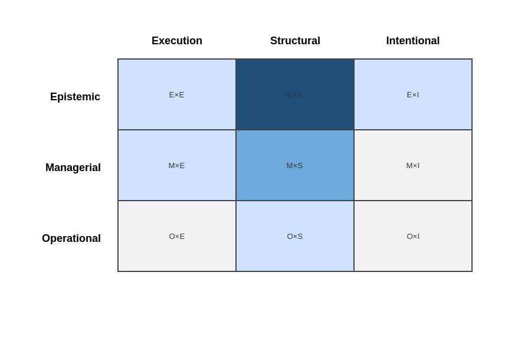

# Architecture-centric approaches

Architecture-centric approaches constitute a family of practices concerned with explicitly describing, evaluating, and governing the structural properties of software systems.  They treat architecture as a primary object of attention and provide mechanisms for documenting decisions, reasoning about trade-offs, and maintaining structural coherence over time.

Representative examples of this family include architectural description standards such as [ISO/IEC/IEEE 42010](https://www.iso.org/standard/50508.html), viewpoint-based approaches such as *Views and Beyond* ([Clements et al., 2010](../../resources/bibliography.md#clements-2010)), evaluation methods such as ATAM developed at the Software Engineering Institute (SEI), lightweight structural modeling approaches such as the [C4 Model](https://c4model.com/), Architecture Decision Records (ADRs), enterprise architecture frameworks such as [TOGAF](https://www.opengroup.org/togaf), and reference architectures used to constrain solution spaces.  While differing in scope and formalism, these approaches share a common commitment to making structural knowledge explicit and inspectable.

## Characteristic orientation

Approaches in this family are primarily oriented toward governing the *structure* of software systems.  Their central concern is the organization of components, interfaces, dependencies, and architectural decisions that shape system behavior and quality attributes.

Architectural description standards such as ISO/IEC/IEEE 42010 formalize the identification of stakeholders, concerns, and viewpoints, framing architecture as a structured response to stakeholder concerns ([ISO/IEC/IEEE 42010](../../resources/bibliography.md#iso-42010-2011)).  *Views and Beyond* operationalizes this perspective by providing systematic guidance for documenting architectural views and maintaining consistency across them ([Clements et al., 2010](../../resources/bibliography.md#clements-2010)).

SEI’s architecture-centric methods, including ATAM and related evaluation frameworks, emphasize systematic reasoning about quality attributes, trade-offs, and risks.  Architecture is evaluated against explicit scenarios, and decisions are examined through structured workshops rather than left implicit in implementation practice ([Clements et al., 2010](../../resources/bibliography.md#clements-2010)).

The [C4 Model](https://c4model.com/) offers a pragmatic visualization scheme for representing structural decomposition at multiple levels of abstraction.  While lightweight, it reinforces the principle that structure should be explicitly represented and shared.  Architecture Decision Records (ADRs) complement structural diagrams by documenting the rationale behind architectural choices, aligning with research on architectural knowledge management ([Kruchten et al., 2015](../../resources/bibliography.md#kruchten-etal-2015); [van der Ven et al., 2006](../../resources/bibliography.md#van-der-ven-etal-2006)).

Enterprise architecture frameworks such as TOGAF extend structural reasoning to the enterprise level.  They introduce governance mechanisms for ensuring alignment between system architectures and broader organizational structures, though often at a higher level of abstraction than system-level architecture practices.

Across these variations, architecture is treated not merely as emergent structure, but as an explicit and reasoned representation subject to evaluation, review, and revision.

## Governance mode emphasis

Analyzed through the governance–knowledge lens, architecture-centric approaches frequently emphasize **epistemic governance** of structural knowledge.

They make architectural representations explicit, inspectable, and evolvable.  Decision rationale, trade-offs, and constraints are articulated in forms that can be debated, reviewed, and preserved over time ([Perry & Wolf, 1992](../../resources/bibliography.md#perry-wolf-1992); [van der Ven et al., 2006](../../resources/bibliography.md#van-der-ven-etal-2006)).  SEI’s evaluation frameworks institutionalize architectural reasoning as a structured, knowledge-based activity rather than as an informal design exercise ([Clements et al., 2010](../../resources/bibliography.md#clements-2010)).

At the same time, many organizations complement epistemic governance with **managerial governance** mechanisms.  Architecture review boards, compliance checks, and approval gates are used to enforce structural constraints and maintain coherence across teams or programs.  Enterprise frameworks such as TOGAF incorporate formal governance structures and role definitions that institutionalize architectural oversight.

The defining feature of this family, however, remains the explicit treatment of structural knowledge as a governable object.

## Primary knowledge object governed

The primary knowledge object governed by architecture-centric approaches is **structural knowledge**.

These approaches explicitly regulate how the system is decomposed, how responsibilities are allocated, how components interact, and how architectural constraints are articulated and preserved.  They address concerns related to modularity, coupling, scalability, performance, and other quality attributes.

Intentional knowledge—such as long-term purpose, explicit non-goals, durable articulation of assumptions, or strategic commitments—is often referenced in architectural documentation as contextual input.  However, it is typically not governed as a first-class, evolvable knowledge object.  Instead, it provides background justification for structural decisions.

Execution practices are influenced indirectly by architecture through constraints and design principles.  However, workflow discipline and coordination mechanisms remain outside the central focus of this family.

## Resulting governance configuration

Taken together, architecture-centric approaches tend to cluster around the following governance configurations within the governance–knowledge matrix:

- **Epistemic × Structural** — governance enacted through explicit architectural models, viewpoints, decisions, and evaluation methods.
- **Managerial × Structural** — governance expressed through architecture boards, review processes, compliance mechanisms, and enterprise architecture oversight.

Occasional movement toward **Epistemic × Execution** may occur when architectural principles are codified into engineering standards or quality attribute guidelines.  However, intentional knowledge is not typically governed as a first-class epistemic object within this family.

This configuration reflects a strong emphasis on structural coherence and architectural reasoning, with comparatively limited systematic focus on durable articulation of system-level intent.  As illustrated in Figure 1, governance effort concentrates in the Structural column—most prominently at the Epistemic × Structural intersection, with secondary managerial reinforcement—while intentional knowledge remains only marginally governed.

  

  <em>Figure 1. Governance–knowledge coverage configuration for architecture-centric approaches.</em>

## Relationship to the upstream problem space

Architecture-centric approaches directly address challenges related to structural coherence and divergence between intent and realized structure.  By making architectural decisions explicit and inspectable, they mitigate uncontrolled erosion and enable systematic evaluation of trade-offs ([de Silva & Balasubramaniam, 2012](../../resources/bibliography.md#de-silva-balasubramaniam-2012); [Capilla et al., 2016](../../resources/bibliography.md#capilla-etal-2016)).

They also partially address implicit and unexamined decisions by formalizing architectural rationale and review processes ([van der Ven et al., 2006](../../resources/bibliography.md#van-der-ven-etal-2006)).  However, challenges such as loss of original intent over time, fragmentation of system understanding across organizational or provider boundaries, and explicit governance of evolving assumptions extend beyond the structural focus of most architecture frameworks ([Lehman & Ramil, 2003](../../resources/bibliography.md#lehman-ramil-2003)).

This observation does not diminish the importance of architectural governance.  Rather, it clarifies that while structural knowledge is treated epistemically, intentional knowledge is not typically governed with the same level of systematic articulation and durability.

## Coverage of recurring challenges

The following table summarizes how architecture-centric approaches typically address the recurring challenges identified in the upstream problem space.

| Recurring Challenge | Typical Coverage | Rationale |
|---------------------|------------------|-----------|
| implicit and unexamined decisions | Medium–High | Architectural evaluation methods and ADRs increase explicit articulation of structural decisions. |
| loss of original intent and rationale over time | Medium | Structural rationale may be documented, but broader system-level intent and non-goals are not systematically preserved. |
| fragmentation of understanding of the software system | Medium–High | Architectural models and viewpoints provide shared representations that improve system-wide understanding. |
| divergence between intent and realized structure | High | Architecture governance directly targets structural coherence and alignment with quality attribute goals. |
| difficulty assessing and governing change | Medium | Architectural evaluations and impact analyses support reasoned structural change. |
| limited ability to revisit and re-evaluate past decisions | Medium–High | Explicit decision documentation enables revisiting structural choices, though systematic re-evaluation of intent remains limited. |

## Next family in the analysis

Architecture-centric approaches demonstrate how structural knowledge can be governed explicitly and epistemically, foregrounding architectural coherence as a primary object of governance.

The governance–knowledge lens is applied next to **[Governance, standards, and compliance frameworks](./governance-and-standards-and-compliance-frameworks.md)**, which emphasize formal oversight, institutional control, and organizational-level articulation of declared intent.
