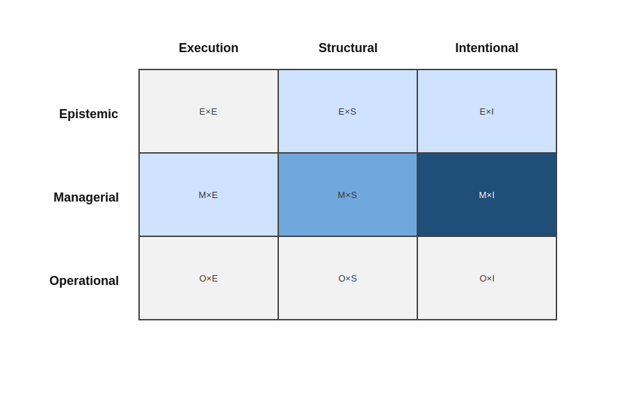

# Governance and compliance frameworks

Governance and compliance frameworks constitute a family of approaches concerned with institutional control, accountability, risk management, and regulatory alignment.  They define principles, responsibilities, oversight mechanisms, and control objectives intended to ensure that organizational activities conform to strategic, legal, or normative requirements.

Representative examples include [COBIT](https://www.isaca.org/resources/cobit), [ISO/IEC 38500](https://www.iso.org/standard/62816.html), enterprise governance frameworks developed by ISACA and similar bodies, and regulatory or audit-oriented governance mechanisms embedded in large organizations.  While differing in scope and formalization, these approaches share a common concern with defining decision rights, oversight structures, and accountability boundaries.

## Characteristic orientation

Approaches in this family are primarily oriented toward governing *organizational responsibility and accountability* rather than directly governing system structure or day-to-day execution practices.

ISO/IEC 38500 articulates principles for the governance of IT at the organizational level, focusing on responsibility, strategy, acquisition, performance, conformance, and human behavior ([ISO/IEC 38500](../../resources/bibliography.md#iso-38500-2015)).  COBIT provides a comprehensive framework of governance and management objectives, defining control practices, performance indicators, and accountability structures ([ISACA, 2019](../../resources/bibliography.md#isaca-2019)).  These frameworks institutionalize governance as a structured system of decision rights, oversight, and accountability mechanisms, rather than as embedded technical practice.

Governance is enacted through policies, committees, audit mechanisms, structured reporting processes, and compliance verification procedures.  The emphasis lies on ensuring that decisions are authorized, traceable, and aligned with declared objectives and risk tolerances.

## Governance mode emphasis

Analyzed through the governance–knowledge lens, governance and compliance frameworks predominantly emphasize **managerial governance**.

Governance is enacted through formally defined roles, oversight bodies, approval structures, and audit mechanisms that institutionalize decision authority and accountability ([ISO/IEC 38500](../../resources/bibliography.md#iso-38500-2015); [ISACA, 2019](../../resources/bibliography.md#isaca-2019)).  Such structures align with research distinguishing hierarchical and institutional coordination mechanisms from practice-embedded or epistemic forms of governance ([Tamburri et al., 2018](../../resources/bibliography.md#tamburri-etal-2018)).

In some cases, documentation requirements introduce limited elements of epistemic governance.  However, the knowledge captured typically serves compliance verification or accountability reporting rather than continuous reasoning about the evolving structure or intent of a specific software system.

## Primary knowledge object governed

The primary knowledge object governed by this family is typically **intent**, expressed at an organizational or strategic level.

Intent appears in the form of governance principles, risk tolerances, control objectives, compliance requirements, and strategic alignment criteria.  These artifacts define what should be achieved or avoided, and under which constraints organizational activities must operate.

Structural knowledge of specific software systems may be referenced as evidence for compliance, but it is not typically governed as an evolving knowledge asset.  Execution practices are regulated indirectly through policy enforcement rather than through embedded operational discipline.

## Resulting governance configuration

Taken together, governance and compliance frameworks tend to cluster around the following governance configurations within the governance–knowledge matrix:

- **Managerial × Intentional** — governance enacted through formal articulation of principles, objectives, risk constraints, and accountability structures.
- **Managerial × Structural** — governance expressed through architectural compliance checks, control requirements, and audit processes.

Epistemic governance is not typically central to this family.  While documentation and reporting are emphasized, these serve oversight and accountability rather than sustained, inspectable stewardship of evolving system knowledge.

This configuration reflects strong formal governance of declared intent at the organizational level, with secondary reinforcement through structural compliance and control requirements, and only limited epistemic stewardship of system-level structural or intentional knowledge.  As illustrated in Figure 1, governance effort concentrates in the **Managerial × Intentional** configuration, with supporting emphasis in **Managerial × Structural** and only marginal coverage in epistemic cells.

  

<em>Figure 1: Governance–knowledge coverage configuration for governance and compliance frameworks.</em>

## Relationship to the upstream problem space

Governance and compliance frameworks directly address challenges related to accountability, clarity of responsibility, and oversight of decision authority.  They reduce ambiguity regarding who may authorize change and under which constraints change may occur.

They partially mitigate implicit and unexamined decisions by imposing formal approval processes and audit trails.  However, such mechanisms do not necessarily ensure that decisions are grounded in explicit, shared system-level knowledge.

Challenges such as fragmentation of understanding of the software system, divergence between declared intent and realized structure, and limited ability to revisit past architectural decisions extend beyond the primary design focus of this family.  Software evolution research has emphasized that long-lived systems require continuous, knowledge-based adaptation mechanisms that transcend initiative- or compliance-driven structures ([Bennett & Rajlich, 2000](../../resources/bibliography.md#bennett-rajlich-2000); [Lehman & Ramil, 2003](../../resources/bibliography.md#lehman-ramil-2003)).

This observation does not diminish the institutional importance of governance frameworks.  Rather, it clarifies that their dominant orientation lies in formal accountability and strategic control, while systematic epistemic stewardship of evolving software systems is not their central concern.

## Coverage of recurring challenges

The following table summarizes how governance and compliance frameworks typically address the recurring challenges identified in the upstream problem space.

| Recurring challenge | Typical coverage | Rationale |
|---------------------|------------------|-----------|
| Implicit and unexamined decisions | Medium | Formal approval processes and oversight mechanisms reduce informal decision-making, but underlying rationale may remain implicit. |
| Loss of original intent and rationale over time | Medium | Strategic intent may be documented in governance artifacts, but system-level rationale is not consistently preserved as an evolvable knowledge asset. |
| Fragmentation of understanding of the software system | Low–Medium | Governance policies clarify responsibilities but do not systematically unify technical understanding across actors. |
| Divergence between intent and realized structure | Medium | Compliance checks may detect deviations, though alignment is assessed at a policy or control level rather than through detailed architectural reasoning. |
| Difficulty assessing and governing change | Medium | Formal review and approval structures provide control over change initiation and authorization. |
| Limited ability to revisit and re-evaluate past decisions | Low–Medium | Audit trails exist, but systematic re-evaluation of architectural and intentional knowledge is not central to the framework. |

## Next family in the analysis

Governance and compliance frameworks demonstrate how declared intent can be governed managerially at an institutional level, emphasizing formal oversight, policy articulation, and accountability structures.

The governance–knowledge lens is applied next to **[Tool-centric and documentation-heavy approaches](./tool-centric-and-documentation-heavy-approaches.md)**, which rely primarily on artifacts, repositories, and documentation systems as instruments of governance.
