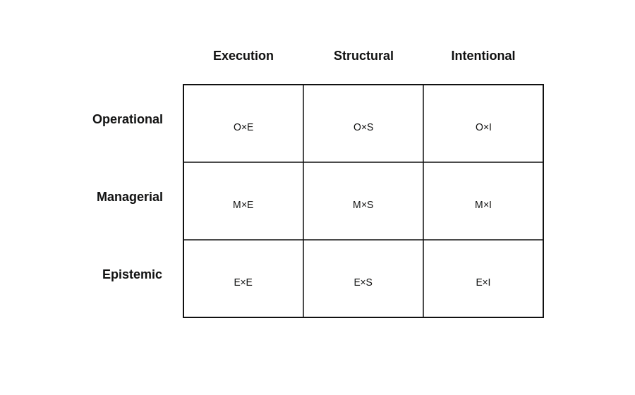

# A comparative lens: governance and knowledge

Existing approaches to software development, management, and governance differ not only in their practices and artifacts, but in how they enact governance and what aspects of the software system they treat as governable.  To understand patterns of coverage across approaches, it is necessary to distinguish these dimensions explicitly.

This page introduces a two-dimensional analytical lens that differentiates governance modes from the primary knowledge objects governed.  The resulting 3×3 matrix provides a structured way to observe how different approaches emphasize execution, structure, or intent, and whether governance is enacted operationally, managerially, or epistemically.

The purpose of this lens is analytical.  It does not rank approaches, prescribe solutions, or define a maturity model.  Instead, it clarifies how governance is structured and provides a conceptual basis for analyzing coverage relative to the upstream problem space.

## Purpose of the comparative lens

The upstream problem space described in the **[Problem space](../problem-space.md)** and articulated through the **[Recurring challenges](../recurring-challenges.md)** reveals a set of persistent patterns affecting the evolution and governance of software systems.  Existing approaches address these challenges in different ways and at different levels.  However, comparing them along a single dimension—such as methodology, scale, or degree of formalization—obscures important structural differences in how governance is enacted and what aspects of the system are subject to control.

To reason systematically about coverage, a more explicit analytical lens is required.  The governance–knowledge matrix introduced in this section differentiates approaches along two orthogonal dimensions: the mode through which governance is exercised, and the primary knowledge object that is governed.  This distinction makes it possible to observe patterns of emphasis and clustering across approaches.

The matrix is descriptive rather than evaluative.  It does not rank approaches, nor does it imply a progression or maturity sequence.  Its purpose is to clarify how different approaches structure governance and what kinds of knowledge they explicitly treat as governable.  In doing so, it provides a conceptual frame for identifying areas of the upstream problem space that are more or less systematically addressed.

## The two analytical dimensions

The governance–knowledge matrix differentiates approaches along two independent dimensions: the mode through which governance is enacted, and the primary knowledge object that is governed.  These dimensions are conceptually distinct.  An approach may exercise governance in different modes while targeting different aspects of the software system.  Clarifying both dimensions makes it possible to observe structural differences that are otherwise obscured in surface-level comparisons.

### Governance mode (vertical axis)

Governance mode refers to the manner in which constraints, criteria, and decision authority are exercised over a software system and its evolution.  It describes *how* governance is enacted, rather than *what* is governed.

The following three governance modes are distinguished: operational, managerial, and epistemic.  These three modes do not form a maturity scale, nor are they mutually exclusive.  In practice, they often coexist within the same organization or approach.  The distinction serves analytical clarity rather than normative ranking.

#### Operational governance

Governance enacted through day-to-day practices and routines that shape how work is performed in concrete situations.  Constraints and expectations are embedded in behavior, tools, and habits.  Decision-making is often local, situated, and partially implicit.

Operational governance is typically close to execution and relies on practice-based discipline rather than formal coordination or explicit knowledge stewardship.

#### Managerial governance

Governance enacted through coordination mechanisms, planning structures, and defined roles.  Constraints and priorities are expressed through plans, objectives, review forums, and allocation decisions.  Authority is exercised through organizational structures and decision processes.

Managerial governance makes control more explicit than operational governance, but it remains primarily focused on coordination and direction rather than on the systematic stewardship of shared knowledge.

#### Epistemic governance

Governance enacted through explicit, inspectable, and evolvable knowledge about the software system.  Constraints and criteria are articulated as shared representations that can be examined, debated, revised, and preserved over time.

Epistemic governance treats knowledge itself as a governable asset.  It enables reasoning about the system and its evolution through structured articulation of decisions, assumptions, constraints, and relationships.

### Primary knowledge object governed (horizontal axis)

The primary knowledge object governed refers to the principal aspect of the software system that is subject to governance.  It describes *what* is being governed: the domain toward which constraints, criteria, and decision authority are directed.

Three conceptually distinct knowledge objects are identified: execution, structural, and intent.  Governance may focus intensively on execution while leaving structure implicit, or may emphasize structural coherence without explicitly governing intent.  Distinguishing among these objects allows a more precise analysis of how approaches address different dimensions of the upstream problem space.

#### Execution knowledge

Governance of execution concerns how work is performed.  It includes practices, routines, task coordination, operational behavior, and immediate technical decisions.  The focus is on activity and performance in the present.

When execution is the primary object governed, attention is directed toward improving how work is carried out, ensuring discipline in day-to-day practices, and shaping the behavior of teams and operators.

#### Structural knowledge

Governance of structure concerns what the software system is.  It includes architectural decomposition, system boundaries, component relationships, interfaces, and structural constraints.  The focus is on the configuration and organization of the system as a technical artifact.

When structure is the primary object governed, attention is directed toward maintaining coherence of system design, managing complexity, and ensuring consistency across components and teams.

#### Intentional knowledge

Governance of intent concerns why the software system exists and under what assumptions it should evolve.  It includes purpose, constraints, commitments, non-goals, trade-offs, and guiding principles that shape long-term direction.

When intent is the primary object governed, attention is directed toward preserving continuity of purpose over time, making assumptions explicit, and enabling principled reasoning about acceptable and unacceptable change.

## The 3×3 governance map

When the three governance modes are considered together with the three primary knowledge objects governed, a 3×3 matrix emerges.  Each cell of the matrix represents a distinct configuration defined by the intersection of a governance mode and a knowledge object.

The matrix does not represent stages, levels, or degrees of maturity.  It is not hierarchical, nor does it imply that one configuration is superior to another.  Instead, it serves as a typology: a structured classification that makes visible how governance may be enacted differently depending on both how it operates and what it targets.

Each row of the matrix corresponds to a governance mode:

- **Operational governance** — governance enacted through practice and routine,
- **Managerial governance** — governance enacted through coordination and planning structures,
- **Epistemic governance** — governance enacted through explicit and inspectable knowledge.

Each column corresponds to a primary knowledge object governed:

- **Execution knowledge** — how work is performed,
- **Structural knowledge** — what the system is,
- **Intentional lnowledge** — why the system exists and under which assumptions it evolves.

Taken together, the matrix distinguishes nine conceptually different governance configurations.  An approach may emphasize one configuration, combine several, or shift across them depending on context.  The purpose of the matrix is to provide a stable conceptual frame within which such patterns can be analyzed systematically in the pages that follow.

Taken together, the two dimensions yield a 3×3 analytical matrix and distinguish nine conceptually different governance configurations.  An approach may emphasize one configuration, combine several, or shift across them depending on context.  The purpose of the matrix is to provide a stable conceptual frame within which such patterns can be analyzed systematically in the pages that follow.  Figure 1 presents the matrix as the reference space used throughout the coverage analysis.

  

  <em>Figure 1. The 3×3 governance–knowledge matrix used as an analytical lens to compare existing approaches.</em>

Subsequent pages position different families of approaches within this matrix in order to analyze patterns of coverage across the upstream problem space.

## Interpreting the nine configurations

The intersection of governance mode and primary knowledge object yields nine conceptually distinct governance configurations.  Each configuration reflects a different way in which constraints, criteria, and decision authority may be exercised over a software system.

The descriptions below summarize the characteristic orientation of each configuration.  They do not imply exclusivity or completeness; in practice, multiple configurations may coexist within the same approach or organization.

### Operational governance

**Operational × Execution**  
Governance of execution enacted through day-to-day practice.  Work routines, behavioral norms, and immediate technical decisions shape how tasks are performed in concrete situations.

**Operational × Structural**  
Governance of structural aspects of the system as they emerge from situated design and implementation decisions.  Structural coherence is influenced through practice rather than through formal coordination or explicit knowledge stewardship.

**Operational × Intentional**  
Governance of system intent embodied implicitly in daily action.  Assumptions about purpose, priorities, and trade-offs guide decisions, but are not systematically articulated or reviewed.

### Managerial governance

**Managerial × Execution**  
Governance of execution through coordination mechanisms, planning structures, and allocation of work.  Direction and control are exercised through roles, schedules, and organizational processes.

**Managerial × Structural**  
Governance of system structure through explicit planning, decision forums, and coordination across teams.  Structural decisions are discussed and managed within defined organizational arrangements.

**Managerial × Intentional**  
Governance of system intent through plans, objectives, commitments, and strategic abstractions.  Purpose and direction are expressed and coordinated, typically in the form of articulated goals and roadmaps.

### Epistemic governance

**Epistemic × Execution**  
Governance of execution through explicit and inspectable knowledge about operational principles, constraints, and practices.  Execution is guided by articulated representations that can be examined and revised.

**Epistemic × Structural**  
Governance of structure through explicit, inspectable, and evolvable representations of architectural decisions and constraints.  Structural coherence is maintained through shared knowledge artifacts.

**Epistemic × Intentional**  
Governance of system intent through explicit and durable articulation of purpose, assumptions, constraints, and non-goals.  Intent is treated as knowledge that can be examined, debated, and preserved over time.

## Using the lens across families of approaches

The governance–knowledge matrix provides a structured frame for examining how different families of approaches enact governance and what aspects of the software system they primarily treat as governable.

In this guidebook, the lens is applied across several families of approaches in software development, management, and governance.  Each family is analyzed in terms of (1) which governance modes it emphasizes and (2) which primary knowledge objects it explicitly governs. The purpose is to make coverage patterns comparable across families, using a shared analytical basis.

You can begin with the first family analysis: **[Methodologies and process frameworks](./methodologies-and-process-frameworks.md)**.

After the families have been examined individually, their aggregate implications can be considered in light of the upstream problem space, making it possible to observe overall coverage patterns across the matrix.

