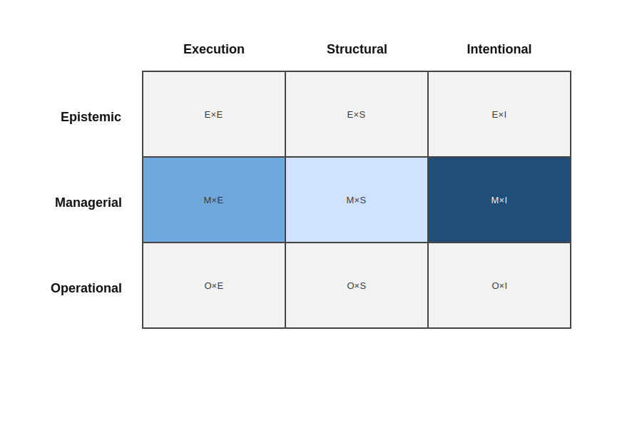

# Project and portfolio management approaches

Project and portfolio management approaches constitute a family of practices concerned with governing initiatives, investments, and resource allocation across time-bounded efforts.  They define structures for planning, prioritization, funding, risk management, and performance evaluation.

Representative examples of this family include the PMBOK-based standards of the [Project Management Institute (PMI)](https://www.pmi.org/pmbok-guide-standards), [PRINCE2](https://www.axelos.com/certifications/prince2), portfolio management practices embedded in [SAFe](https://scaledagileframework.com/portfolio/), and governance-oriented frameworks such as [COBIT](https://www.isaca.org/resources/cobit).  These approaches are grounded in established project and governance standards (see [PMI, 2021](../../resources/bibliography.md#pmi-2021); [AXELOS, 2017](../../resources/bibliography.md#axelos-2017); [ISACA, 2019](../../resources/bibliography.md#isaca-2019)).  While differing in scope and emphasis, they share a common focus on structuring and governing initiatives rather than on regulating day-to-day development practices.

In relation to the upstream problem space described in the **[Problem space](../problem-space.md)** and articulated through the **[Recurring challenges](../recurring-challenges.md)**, project and portfolio management approaches are especially relevant because they influence how change is initiated, justified, funded, and evaluated over time.

## Characteristic orientation

Approaches in this family are primarily oriented toward governing *initiatives* rather than continuously evolving systems.  Their central concern is the definition, authorization, monitoring, and closure of projects, as well as the alignment of multiple initiatives within broader organizational strategy.

They assume that governance can be achieved through structured planning processes, formal roles, documented objectives, stage gates, performance metrics, and defined approval mechanisms ([PMI, 2021](../../resources/bibliography.md#pmi-2021); [AXELOS, 2017](../../resources/bibliography.md#axelos-2017)).  Risk management, cost estimation, scheduling, and benefit realization are treated as core instruments of control.

Portfolio-level variants extend this logic by prioritizing and sequencing investments, balancing resource allocation, and aligning initiatives with strategic objectives.  Governance is thus exercised through structured decision-making forums and formalized oversight mechanisms, consistent with enterprise governance models such as COBIT and ISO/IEC 38500 ([ISACA, 2019](../../resources/bibliography.md#isaca-2019); [ISO/IEC, 2015](../../resources/bibliography.md#iso-38500-2015)).

## Governance mode emphasis

Analyzed through the governance–knowledge lens, project and portfolio management approaches predominantly emphasize **managerial governance**.

Constraints and decision authority are expressed through defined roles (e.g., project sponsors, steering committees), stage-gate reviews, funding approvals, and formal reporting structures.  Governance is enacted through coordination mechanisms and hierarchical accountability rather than through embedded daily practice.  This orientation reflects classical managerial control structures in which authority, reporting, and oversight are formalized within organizational hierarchies ([ISO/IEC, 2015](../../resources/bibliography.md#iso-38500-2015)).

At the portfolio level, governance extends to investment prioritization, resource balancing, and strategic alignment.  Decision-making is centralized or formally delegated, and control is exercised through planning artifacts, dashboards, and review processes.

Operational governance may exist within individual projects, but it is not the defining characteristic of this family.  Likewise, epistemic governance—understood as stewardship of durable, inspectable knowledge about the software system—is not typically the primary mode through which these approaches operate.

## Primary knowledge object governed

The primary knowledge object governed by project and portfolio management approaches is typically **intent**, expressed in managerial terms.

Intent is articulated as objectives, business cases, value propositions, expected benefits, and strategic alignment criteria.  These artifacts guide decision-making about which initiatives should be undertaken, continued, or terminated.

Execution is governed indirectly through schedules, milestones, and deliverable definitions.  Structural knowledge of the software system—its architecture, boundaries, or long-term design coherence—is generally treated as an input to project planning rather than as an explicit object of governance in its own right.

As a result, intentional knowledge is framed primarily in terms of planned outcomes and investment justification rather than as durable, inspectable knowledge about system purpose, assumptions, or constraints over time.

## Resulting governance configuration

Taken together, project and portfolio management approaches tend to cluster around the following governance configurations within the governance–knowledge matrix:

- **Managerial × Intentional** — governance enacted through formal articulation of objectives, business cases, and strategic alignment criteria.
- **Managerial × Execution** — governance expressed through planning structures, schedules, milestones, and coordination mechanisms.

Structural knowledge and epistemic governance configurations are not typically central to this family. Architectural or design considerations may inform decision-making, but they are usually subordinate to planning and investment frameworks rather than governed as explicit knowledge assets. As illustrated in Figure 1, governance effort concentrates in the **Managerial × Intentional** configuration, with secondary emphasis on **Managerial × Execution**, while epistemic cells remain largely unactivated.

  

<em>Figure 1. Governance–knowledge coverage configuration for project and portfolio management approaches.</em>

## Relationship to the upstream problem space

Project and portfolio management approaches directly address challenges related to resource allocation, prioritization of initiatives, risk management, and strategic alignment. They provide mechanisms for coordinating large-scale change efforts and for making investment decisions visible and accountable.

However, the upstream problem space extends beyond the governance of time-bounded initiatives. Long-lived software systems evolve continuously, often across multiple projects and organizational configurations. Software evolution research has emphasized that systems persist and change long after individual projects conclude, and that project-based structures do not fully account for this ongoing evolution ([Lehman & Ramil, 2003](../../resources/bibliography.md#lehman-ramil-2003); [Bennett & Rajlich, 2000](../../resources/bibliography.md#bennett-rajlich-2000)).

This observation does not diminish the importance of project and portfolio management within organizations. Rather, it clarifies their dominant locus of governance: initiatives and investments. Certain upstream challenges, however, concern the sustained articulation, preservation, and evolution of software systems across successive initiatives and beyond individual project lifecycles.

## Coverage of recurring challenges

The following table summarizes how project and portfolio management approaches typically address the recurring challenges identified in the upstream problem space. The assessment reflects their dominant orientation and design intent.

| Recurring Challenge | Typical Coverage | Rationale |
|---------------------|------------------|-----------|
| implicit and unexamined decisions | Medium | Stage gates, approval workflows, and formal reviews surface some decisions, but many technical and architectural decisions remain implicit within projects and teams. |
| loss of original intent and rationale over time | Low–Medium | Business cases, charters, and benefit statements preserve intent at approval time, but rationale is often project-scoped and not maintained as durable system-level knowledge across successive initiatives. |
| fragmentation of understanding of the software system | Low–Medium | Portfolio artifacts provide initiative-level visibility, but they rarely establish shared, evolving representations of the software system that persist across projects and organizational boundaries. |
| divergence between intent and realized structure | Low | Governance focuses on intended outcomes and delivery milestones; structural drift and architecture conformance are typically treated as local engineering concerns rather than portfolio-governed knowledge. |
| difficulty assessing and governing change | Medium–High | These approaches are designed to authorize, prioritize, fund, and control initiatives, providing strong mechanisms for initiating and managing change, but primarily at the level of projects rather than continuous system evolution. |
| limited ability to revisit and re-evaluate past decisions | Medium | Audit trails, approvals, and reporting support revisiting investment decisions, but do not systematically support re-evaluating technical and architectural decisions as the software system and its context evolve. |

## Next family in the analysis

This analysis complements the examination of methodologies and process frameworks by shifting attention from execution discipline to initiative-level governance, where objectives, funding decisions, and strategic alignment criteria become central.

The governance–knowledge lens is applied next to **[Architecture-centric approaches](./architecture-centric-approaches.md)**, which foreground structural coherence and architectural reasoning as primary objects of governance.
