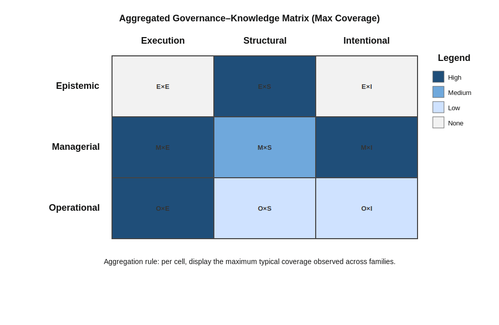

# Synthesis: Aggregate coverage and observed patterns

The governance–knowledge matrix, applied to major families of approaches, reveals a consistent structural pattern in how software systems are governed. Across methodologies, project and portfolio frameworks, architecture-centric practices, governance standards, and tool-centric approaches, governance effort concentrates in specific configurations while remaining comparatively sparse in others.

This page synthesizes those patterns. Its purpose is not evaluative; it does not rank or dismiss approaches. Instead, it identifies structural asymmetries in governance distribution and relates them to the recurring challenges articulated in the upstream problem space.

Two complementary perspectives are used:

- an aggregated governance–knowledge matrix, and  
- a cross-family table mapping recurring challenges to typical coverage levels.

## Aggregated governance–knowledge matrix

Figure 1 shows the aggregated coverage across families. For each cell of the matrix, the highest level of coverage observed among the analyzed families is represented. The aggregation rule is **maximum-based**, not additive: a cell appears dark only if at least one family strongly activates that configuration.

This rule is intentionally conservative. It prevents the appearance of strength through accumulation of weak contributions. A configuration is shown as strong only if at least one family explicitly and systematically foregrounds it.

  

<em>Figure 1: Aggregated governance–knowledge coverage across analyzed families of approaches.</em>

The matrix distinguishes nine conceptually different governance configurations. An approach may emphasize one configuration, combine several, or shift across them depending on context. The purpose of the matrix is to make these patterns visible in a stable conceptual frame.

### Observed structural concentrations

The aggregated matrix reveals not merely variation, but a patterned distribution of governance effort across configurations.

First, governance of **execution** is strongly institutionalized. Both operational and managerial modes are heavily activated in the Execution column. Methodologies concentrate governance in Operational × Execution, while scaled and portfolio frameworks reinforce Managerial × Execution. As a result, how work is performed and coordinated is extensively governed across families.

Second, **managerially articulated intent** is strongly governed. Project, portfolio, and enterprise governance frameworks activate the Managerial × Intentional configuration through formal articulation of objectives, funding criteria, compliance constraints, and strategic alignment mechanisms. Organizational intent is made explicit—but primarily in planning and control terms.

Third, **structural governance** receives strong conceptual emphasis in architecture-centric approaches.  These approaches explicitly activate the Epistemic × Structural configuration through architectural descriptions, viewpoints, and decision records (see [ISO/IEC/IEEE 42010, 2011](../../resources/bibliography.md#iso-42010-2011); [Kruchten et al., 2015](../../resources/bibliography.md#kruchten-etal-2015)).  Documentation-heavy and governance frameworks further reinforce Managerial × Structural activation through compliance requirements and artifact control.

The issue, however, is not the conceptual absence of structural governance.  It is its **durability under long-term evolution**.

Empirical studies of architectural knowledge management consistently report that architectural rationale and documentation are difficult to sustain over time.  Decision records become outdated, viewpoints fall out of sync with implementation, and structural intent decays unless supported by ongoing institutionalized stewardship (see [van der Ven et al., 2006](../../resources/bibliography.md#van-der-ven-etal-2006); [Kruchten et al., 2015](../../resources/bibliography.md#kruchten-etal-2015)).  Even when Epistemic × Structural governance is formally established, its practical continuity across projects, organizational change, and provider transitions is fragile.

The structural asymmetry revealed by the matrix therefore concerns not only distribution across families, but temporal sustainability.  Structural knowledge is often articulated at particular moments — for example, during major redesigns or transformation initiatives — yet it is less frequently institutionalized as a continuously stewarded knowledge asset across the lifespan of long-lived software systems.

A further structural observation concerns the **Operational × Intentional** configuration. System-level intent may be informally embodied in day-to-day practices, shared culture, or tacit understanding within stable teams. However, such operational enactment does not typically constitute durable governance of intent across time, organizational boundaries, or provider transitions.

The limited activation of this cell reflects a structural constraint: operational practices are effective for regulating execution, but they are inherently localized and actor-dependent. As teams change and systems evolve, tacit intent lacks the stability required for long-lived governance. Durable stewardship of system-level intent therefore requires mechanisms beyond operational practice alone.

## Cross-family coverage of recurring challenges

The structural view above can be complemented by examining how families address the recurring challenges identified in the upstream problem space:

- implicit and unexamined decisions  
- loss of original intent and rationale over time  
- fragmentation of understanding of the software system  
- divergence between intent and realized structure  
- difficulty assessing and governing change  
- limited ability to revisit and re-evaluate past decisions  

The following table summarizes typical coverage levels based on dominant design intent and characteristic practice patterns.

| Recurring challenge | Methodologies and process frameworks | Project and portfolio management approaches | Architecture-centric approaches | Governance and compliance frameworks | Tool-centric and documentation-heavy approaches |
|---------------------|--------------|---------------------|----------------------|------------------------|--------------|
| Implicit and unexamined decisions | Low–Medium | Medium | Medium | High | Medium |
| Loss of original intent and rationale over time | Low | Low–Medium | Medium | Medium | Medium |
| Fragmentation of understanding of the software system | Medium | Medium | High | Medium | Medium–High |
| Divergence between intent and realized structure | Low–Medium | Low | Medium–High | Medium | Medium |
| Difficulty assessing and governing change | Medium–High | High (initiative level) | Medium | High (compliance level) | Medium |
| Limited ability to revisit and re-evaluate past decisions | Low | Low–Medium | Medium | Medium | Medium |

### Interpreting the table

The table reveals not isolated strengths and weaknesses, but a coherent structural pattern.

**1. Change initiation and coordination are well supported.**  
The challenge *difficulty assessing and governing change* receives consistently strong coverage. Methodologies support adaptive change at the execution level; project and portfolio approaches institutionalize authorization and prioritization of initiatives; governance frameworks reinforce oversight and compliance. Contemporary approaches are structurally optimized to initiate, fund, control, and monitor change.

**2. Visibility of decisions is partially supported — but unevenly.**  
The challenge *implicit and unexamined decisions* is addressed most strongly by formal governance frameworks and moderately by architecture- and tool-centric approaches. However, execution-focused methodologies provide only partial coverage. Decision visibility improves under compliance pressure, but remains less systematic in everyday practice.

**3. Structural understanding receives concentrated but specialized attention.**  
The challenge *fragmentation of understanding of the software system* is most strongly addressed by architecture-centric approaches, with tool-centric repositories providing secondary support. Other families contribute indirectly, but do not treat system-wide structural understanding as a primary governance object.

**4. Durable intent and revisitability remain comparatively weak across families.**  
The most persistent asymmetry concerns:

- *loss of original intent and rationale over time*, and  
- *limited ability to revisit and re-evaluate past decisions*.

No family exhibits consistently high coverage of these challenges. Even where intent is articulated (e.g., in business cases or vision statements), it is typically project-scoped or managerially framed, and rarely institutionalized as durable, inspectable, and systematically revisitable system-level knowledge.

**5. Alignment between intent and structure is only partially governed.**  
The challenge *divergence between intent and realized structure* receives medium-to-high coverage only within architecture-centric approaches. In other families, alignment mechanisms are indirect or localized. As a result, long-term coherence between declared purpose and evolving structure depends heavily on contextual discipline rather than on explicit epistemic governance mechanisms.

---

Taken together, these patterns reinforce the structural asymmetry identified in the aggregated matrix. Contemporary families of approaches are strong in governing execution, investment, and compliance. They are moderately effective in documenting structure and surfacing decisions.  

They are comparatively less systematic in stewarding durable system-level intent and in institutionalizing mechanisms for sustained, epistemic re-evaluation over time.

This asymmetry directly corresponds to several upstream challenges, particularly those involving long-lived intent, rationale preservation, and revisitability across successive initiatives and organizational transitions.

## Structural asymmetry in governance

When Figure 1 and the challenge table are considered together, a structural asymmetry becomes visible:

- Execution is strongly governed.
- Investment intent is managerially governed.
- Structure is epistemically governed in architecture-centric contexts.
- **System-level intent as durable, inspectable knowledge is not systematically governed.**

This asymmetry is not accidental. It reflects dominant assumptions embedded in existing approaches:

- Work must be organized and controlled.  
- Investments must be justified and overseen.  
- Architecture must be described and structured.  

But the ongoing epistemic stewardship of *why the system exists*, *under what assumptions it evolves*, and *which commitments must remain stable across time and providers* is rarely institutionalized as a primary governance concern.

As a result, the recurring upstream challenges are not random failures. They are predictable consequences of this structural distribution of governance attention.

## Implication for the upstream problem space

The synthesis does not suggest that existing families are insufficient within their intended scope. Each addresses essential dimensions of software development and organizational control.

However, the aggregated analysis shows that:

- Epistemic governance exists — but is concentrated on structure.
- Managerial governance of intent exists — but is concentrated on initiatives and investment.
- Execution governance is highly developed.
- Epistemic governance of system-level intent remains structurally underrepresented.

This structural pattern aligns directly with the persistent upstream challenges identified earlier.

## Transition

The synthesis therefore motivates a more precise question:

If execution, investment intent, and structural knowledge are already governed in established ways, what form of governance is required to systematically address durable, epistemically articulated system-level intent and its evolution over time?

The next part of this guidebook introduces **Upstream Software Engineering** as a discipline explicitly concerned with that question.

Proceed to **Foundations**.